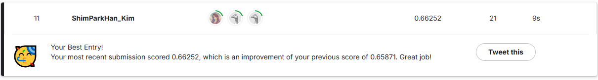

<div align="center">
  <h1>박상희 · AI Engineer</h1>
  <h3>데이터 품질 통제 × 모델 성능 검증 × AI 서비스 구현</h3>
  <p>
    데이터 전처리부터 모델 학습·추론·평가, API·DB 연동, AWS 실행 환경 구성까지 경험했습니다.<br/>
    <strong>콜센터 STT 품질 검증 · LLM 상담 요약/품질 평가 벤치마크 · 금융 AI 챗봇 · 비속어 필터링 · AI 위험성평가 서비스</strong>를 수행했습니다.
  </p>
  <p>
    
    
    
    
    
    
  </p>
  <p>
    <strong>씨넷테크놀로지 AI 엔지니어 인턴 · 2025.03 ~ 2025.05</strong><br/>
    NLP · STT/ASR · LLM Evaluation · AI Backend
  </p>
</div>

---

## 🔎 Profile at a Glance

| 영역 | 핵심 경험 | 검증 포인트 |
|---|---|---|
| **STT / ASR** | 콜센터 음성 품질 검증 · Whisper 비교/파인튜닝/후처리 | 1,000건 검수 → 992개 평가 · 기본 모델 6종 · CER 조건별 분리 |
| **LLM Evaluation** | 상담 요약·품질 평가 후보 비교 | 26개 테스트 기록 → 12개 상세 비교 · 공동 최고 230/240 3개 |
| **NLP Service** | MAP 금융 챗봇 · X-filter | KF-DeBERTa 의도 분류 · KcBERT 비속어 분류 · 검색/생성 파이프라인 |
| **AI Backend / AWS** | CLEAR 위험성평가 서비스 | FastAPI · RDS/S3 · EC2 · Nginx/Uvicorn · GitHub Actions |

> 강점은 단순히 모델을 학습하는 데 그치지 않고, **입력 조건을 통제하고 → 같은 조건에서 비교하고 → 평가 기준을 분리하고 → API·DB·배포 환경까지 연결하는 것**입니다.

---

# 01. Industry Experience

## 🎧 Call Center STT Quality Validation & Post-processing

**씨넷테크놀로지 · AI 엔지니어 인턴 · 2025.03 ~ 2025.05**  
`STT 전처리` · `모델 비교` · `Full fine-tuning` · `CER 평가` · `후처리`

### What I did

- 인턴 동료와 함께 원본 음성 **1,000건**을 직접 청취·검수하고, 발화가 없는 무음 8건을 제외해 **992개 유효 평가 샘플** 확정
- PCM/WAV의 샘플레이트·채널·샘플 폭을 확인해 **16kHz · mono · 16-bit WAV**로 입력 조건 통일
- 30초 초과 음성을 중간 묵음 지점에서 수동 분할해 각 구간을 30초 이하로 구성
- Whisper 기본 모델 **6종**을 동일한 992개 평가 샘플에서 비교
- Full fine-tuning Grid Search 및 CER 기반 조건별 검증
- CER ≥ 0.3인 **22개 고오류 샘플**을 선별해 학습된 여러 모델로 재추론
- 세그먼트 병합 · 반복어/특수문자/공백 정리 · 텍스트 정규화 후처리 적용

### Validation Results

| 평가 조건 | 평균 CER | 비고 |
|---|---:|---|
| **Large v3 Turbo · Base** | **0.0889** | 기본 모델 6종 비교 결과 |
| **Full fine-tuning · Raw output** | **0.1756** | lr 3.16e-6 · 4 epochs · linear scheduler |
| **Full fine-tuning + Post-processing** | **0.0761** | lr 1e-5 · 3 epochs · 세그먼트 병합/텍스트 정규화 포함 |

> **주의:** `0.0889`, `0.1756`, `0.0761`은 동일 설정의 순차 개선값이 아닙니다.  
> 기본 모델 · 파인튜닝 원본 출력 · 후처리 포함 결과의 **서로 다른 평가 조건**입니다.

**Training data** · 텍스트 포함 학습 세그먼트 **4,727개** · rx/tx 화자 채널 음성 **971개**

**Tech**  
`Python` `PyTorch` `Hugging Face Transformers` `Whisper` `CER` `Google Colab`

📄 [STT 검증 요약 문서 보기](./docs/STT_WhisperLargeV3Turbo_검증요약_최종(0.0761)_20250529.md)

> 회사 원본 음성 · 정답 전사 · 고객정보 · 내부 원본 코드는 공개하지 않습니다.

---

## 🧠 LLM Call Center Summary & Evaluation Benchmark

**씨넷테크놀로지 · AI 엔지니어 인턴 · 2025.03 ~ 2025.05**  
`GGUF 후보 조사` · `로컬 실행` · `공통 조건 설계` · `출력 기록` · `자체 평가`

### Benchmark Setup

- 상담 데이터 활용 아이디어 **7개** 기획
- 동일 상담 예시 **1건**과 동일한 **3단계 프롬프트**를 후보별로 적용
- 동일 모델 계열의 양자화 버전·미완료 실행을 포함해 **26개 테스트 기록** 정리
- 완전한 3단계 출력과 8개 평가 결과가 확보된 **12개 모델** 상세 비교
- LLM 출력 자체를 **8개 항목 × 30점 = 240점**의 프로젝트 자체 기준으로 평가

### 3-step Prompt

1. 상담 목적·주요 내용을 JSON으로 요약
2. 한 문장 제목 · 2문장 요약 · 핵심어 1개 생성
3. 상담원 응대 항목 판정 및 개선점 생성

### Top Model Group

| 모델 | 크기 | 점수 | 관찰된 강점 |
|---|---:|---:|---|
| **Microsoft Phi-4 Q4** | 14B | **230/240** | 전반 품질 · 반복 일관성 |
| **Llama-3 Korean Bllossom Q4_K_M** | 8B | **230/240** | 점수 합산 · 한국어 맥락 |
| **Mistral-Small 24B Instruct Q4_K_L** | 24B | **230/240** | 요약 길이 준수 · 일관성 |

> 이 평가는 **공인 벤치마크가 아닌 프로젝트 자체 기준**이며, 제한된 상담 예시 1건을 이용한 후보 비교입니다.  
> 공동 최고 3개는 단일 운영 모델 확정이 아니라 **상위 후보군 도출 결과**입니다.

**Tech**  
`GGUF` `Prompt Engineering` `LLM Evaluation` `JSON Output Analysis`

---

# 02. AI Service Projects

## 💰 MAP · Financial AI Chatbot

**2024.07 ~ 2024.10 · AI 파트장**  
[](https://github.com/LittlePrince327/AICC_MyAssetPlan)

분산된 자산 관리·주가·경제 뉴스 기능을 하나의 웹 서비스로 통합하고, **자연어 질의를 실제 기능으로 연결하는 금융 AI 챗봇**을 개발했습니다.

### My Contribution

- KF-DeBERTa 기반 재무·주식·FAQ **의도 분류 모델 학습·평가**
- 날짜·지출·소득·투자자산 등 엔터티 추출과 의도별 기능 라우팅
- `Naver News API → PageRank 요약 → SentenceTransformer 임베딩 → FAISS Top-K 검색 → GPT2LMHeadModel 답변 생성` 흐름 구현
- 브라우저 Web Speech API 기반 STT/TTS 연동
- AI 파트 일정 관리 · 모델 연계 검토 · 챗봇 통합

### Intent Classification

| Accuracy | Precision | Recall | F1 |
|---:|---:|---:|---:|
| **0.90** | **0.91** | **0.90** | **0.90** |

**Tech**  
`KF-DeBERTa` `SentenceTransformer` `FAISS` `GPT2LMHeadModel` `PageRank` `MariaDB` `Web Speech API`

---

## 🛡️ X-filter · SNS Profanity Filtering & Rewriting

**2023.10 ~ 2023.12 · 인공지능사관학교 4기 기업연계 팀 프로젝트**  
[](https://github.com/LittlePrince327/X_filter)

SNS 게시글·캡션·채팅 문장에서 **비속어 포함 여부를 분류**하고, 정상 문장은 유지하며 비속어 문장에는 사전 기반 순화 표현 후보를 제시하는 프로토타입을 개발했습니다.

### My Contribution

- AI 파이프라인 구조 설계 · 비속어 데이터 전처리 공동 수행
- **Logistic Regression · RandomForest · KcELECTRA · KcBERT** 비교·평가
- KcBERT 분류 모델 학습·평가 및 혼동행렬 기반 오류 분석
- 사전 기반 치환 로직 · RNN/LSTM 기반 대체 문장 생성 실험
- **Django REST API 엔드포인트 골격 구현**

### Dataset

| 구분 | 데이터 |
|---|---:|
| 원본 문장 | **214,189건** |
| 학습/평가 분리 | **8:2 · random_state=42** |
| 중복 제거 후 학습 | **167,709건** |
| 중복 제거 후 평가 | **42,587건** |

### KcBERT Classification

> **저장된 KcBERT 평가 혼동행렬 기준 재계산** · positive class = 비속어(label 1)

| Accuracy | Precision | Recall | F1 |
|---:|---:|---:|---:|
| **0.9648** | **0.9651** | **0.9709** | **0.9680** |

<details>
<summary><b>Confusion Matrix 값 보기</b></summary>
<br/>

| TN | FP | FN | TP |
|---:|---:|---:|---:|
| 18,389 | 820 | 680 | 22,698 |

</details>

### Replacement / Generation

- 사전 기반 치환 및 RNN·LSTM 기반 대체 문장 생성 실험
- 과거 프로젝트 문서에는 **BLEU 73**이 기록되어 있으나, 최종 원시 예측·참조 문장과 평가 로그를 한 세트로 확보한 뒤 재평가가 필요합니다.
- 동일 조건 재평가 절차는 [X-filter `evaluation/`](https://github.com/LittlePrince327/X_filter/tree/main/evaluation)과 [`docs/XFILTER_METRICS.md`](https://github.com/LittlePrince327/X_filter/blob/main/docs/XFILTER_METRICS.md)에 정리했습니다.

**Tech**  
`KcBERT` `KcELECTRA` `scikit-learn` `RNN` `LSTM` `Django REST Framework`

---

## 🏗️ CLEAR · AI Risk Assessment Service

**2025.11 ~ 2025.12**  
`AI 기능 개발` · `백엔드 중심 구현` · `RDS/S3 연동` · `AWS 배포`

안전공학 석사학위 논문 연구 과정에서 활용하기 위해, 현장 사진과 작업 상황 설명을 입력받아 위험요인·현재조치·개선대책·위험수준의 **초안**을 생성하고 사용자가 검토·수정·선택한 결과를 저장하는 위험성평가 웹 서비스를 구현했습니다.

### AI / Backend Flow

```text
현장 사진 + 작업 코멘트
        ↓
MIME · 이미지 수 · 용량 검증 / 이미지 압축
        ↓
OpenAI Responses API · Vision + Text
        ↓
첫 JSON 추출 · 키 정규화 · Pydantic 검증
        ↓
위험요인 · 현재조치 · 개선대책 · 위험수준 초안
        ↓
사용자 검토 · 수정 · 선택
        ↓
PostgreSQL(RDS) 저장 · S3 private 이미지 연동
```

### My Contribution

- OpenAI Responses API 기반 멀티모달 위험성평가 초안 생성
- MIME·이미지 수·용량 검증 · 이미지 압축 · 가변 이미지 입력 처리
- 첫 JSON 추출 · 영문/한글 키 정규화 · Pydantic 검증 · 한글 JSON 반환
- `/assess` 평가 API 및 `/api/hazard-decisions` 사용자 선택값 저장 흐름 구성
- 사용자 선택 결과 **AWS RDS(PostgreSQL)** 저장 · **S3 private 이미지** 연동
- 실제 RDS 적용 기준 **10개 테이블** DDL 구성·연동
- **EC2 · RDS · S3** 기반 실행·데이터 환경 구성
- **Nginx · Uvicorn · systemd** 실행 환경 구성 및 외부 API 동작 확인
- **GitHub Actions main 브랜치 자동 배포** 흐름 구성

### Boundary

- AI가 최종 판단을 대신하지 않고 **위험성평가 초안**을 제공합니다.
- 제 담당 범위는 **AI 기능 · 백엔드 · 데이터 저장 · AWS 배포 환경** 중심입니다.
- 논문 저자가 아니라 **시스템 구현 기여자**입니다.

**Tech**  
`Python` `FastAPI` `Pydantic` `OpenAI Responses API` `PostgreSQL` `AWS RDS` `AWS S3` `AWS EC2` `Nginx` `Uvicorn` `systemd` `GitHub Actions`

---

# 03. Tech Stack

| 영역 | 기술 |
|---|---|
| **Languages / Data** | `Python` `SQL` `pandas` `NumPy` |
| **AI / ML** | `PyTorch` `Hugging Face Transformers` `Whisper` `KF-DeBERTa` `KcBERT` `KcELECTRA` `scikit-learn` `XGBoost` |
| **LLM / NLP** | `GGUF` `Ollama` `OpenAI API` `SentenceTransformer` `FAISS` `Prompt Engineering` `LoRA/PEFT` `Quantization` |
| **Backend / DB** | `FastAPI` `Pydantic` `PostgreSQL` `MariaDB` `AWS RDS` |
| **Infra / Deployment** | `Git` `GitHub` `Linux` `AWS EC2` `AWS S3` `Nginx` `Uvicorn` `systemd` `GitHub Actions` `CI/CD` |

---

# 04. Certifications & Competitions

## 🎓 Certifications

- **빅데이터분석기사**
- **SQLD (SQL 개발자)**
- **ADsP (데이터분석 준전문가)**
- **프롬프트엔지니어 2급**

## 🏆 Kaggle

### Korean Hate Speech Detection · Top 8%

[Competition](https://www.kaggle.com/competitions/korean-hate-speech-detection) · [Result Image](./picture/kaggle_contest_reward.png)

<details>
<summary><b>결과 이미지 보기</b></summary>
<br/>

</details>

### Natural Language Processing with Disaster Tweets · Top 7%

[Competition](https://www.kaggle.com/competitions/nlp-getting-started/overview) · [Result Image](./picture/Natural%20Language%20Processing%20with%20Disaster%20Tweets.png)

<details>
<summary><b>결과 이미지 보기</b></summary>
<br/>

</details>

---

# 05. Education

- **한국방송통신대학교 통계·데이터과학과** · 재학 · 2026.03 ~
- **코드랩아카데미 AICC 2기** · 수료 · 2024.04 ~ 2024.10
- **인공지능사관학교 4기** · 수료 · 2023.06 ~ 2023.12
- **동신대학교 사회복지학과** · 학사 · 2014.03 ~ 2020.02

---

# 06. Algorithm & Problem Solving

<p align="center">
  <a href="https://solved.ac/profile/tkdgml5717">
    
  </a>
</p>

---

<div align="center">
  <h2>Contact</h2>
  <p>
    <strong>Email</strong> · tkdgml571728@gmail.com<br/>
    <strong>GitHub</strong> · <a href="https://github.com/LittlePrince327">github.com/LittlePrince327</a>
  </p>
</div>
